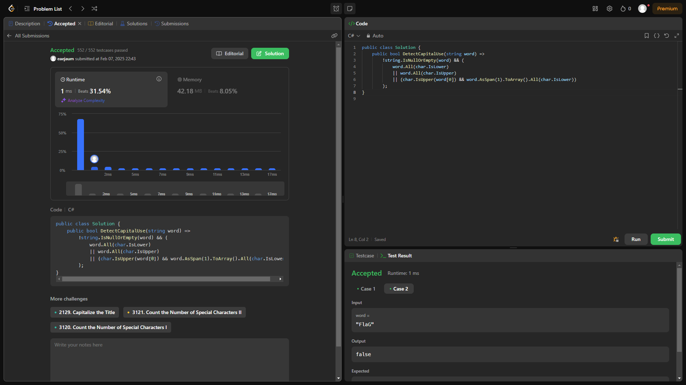
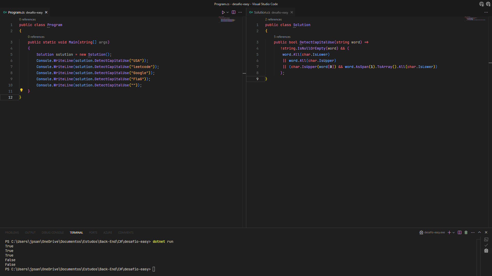

# Detect Capital From String

Este projeto contém uma implementação para verificar se a string possui todas as suas letras maiúsculas, minúsculas ou sua primeira letra maiúscula e as demais mínusculas. Além de fazer validação e tratamento, caso nenhuma dessas condições seja verdadeira ou caso a string seja vazia ou nula.

source: [LeetCode](https://leetcode.com/problems/detect-capital/description/)

## Descrição do Algoritmo

### Como Funciona

O algoritmo verifica se a string não é vazia ou nula e se atende à alguma das condições destacadas acima. Se atender, retorna true; caso contrário, retorna false.

*Passos do Algoritmo:*
1. *Inicialização:* O método em questão recebe uma string via parâmetro.
2. *Verificação:* Verifica se a string de fato existe e se alguma da condições é atendida. Se sim, isso significa que a string é valida com base nas condições consideradas verdadeiras pelo sistema. Caso contrário, o sistema entende que a string recebida não é considerada válida com base nas condições ou até mesmo é vazia ou nula, e então, retorna false.
3. *Retorno:* Retorna true se a string não for vazia ou nula e atender alguma das condições verdadeiras; caso contrário, retorna false.

### Escolha do AsSpan

Optei pelo uso do AsSpan para melhorar a performance e simplificar o código. Como ele cria uma "janela" sobre a string original sem realizar cópias na memória, o sistema consegue executar os comandos subsequentes de forma mais eficiente, reduzindo o consumo de recursos e evitando alocações desnecessárias.

### Considerações

Vale resaltar que optei por manter um código limpo, simples e ao mesmo tempo perfomático. Haviam outras formas mais perfomáticas que resolveriam o problema um pouco mais rápido, como por exemplo usar BitWise Shift, mas avaliei e o código ficaria muito poluido e mais extenso, então, decidi manter meu código conciso e compacto.

## Resultado final

